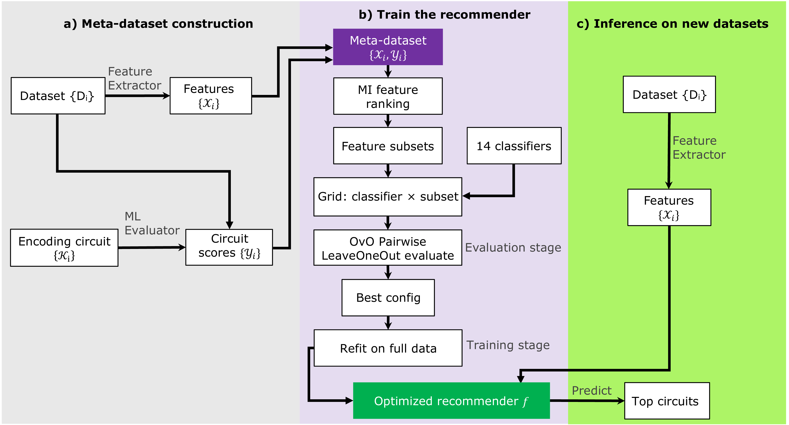

# Qmes

[](https://github.com/tungduy1704/Qmes/actions/workflows/ci.yml)

**Q**uantum **M**eta-learning for **E**ncoding **S**election — a meta-learning framework that recommends a suitable quantum encoding circuit for a given dataset **without running any quantum evaluation at inference time**.

📖 **Documentation:** [tungduy1704.github.io/Qmes](https://tungduy1704.github.io/Qmes)

Given a new dataset `(X, y)` and a task type, Qmes extracts classical complexity meta-features and uses an offline-trained classical meta-learner to predict which encoding circuit (from a fixed pool) is most likely to perform best — collapsing what would otherwise be an expensive per-circuit quantum search into a single forward pass.

> **Status:** research code (v0.1.0). Classification and Regression pipelines are implemented end-to-end. Other task types are planned (see [Roadmap](#roadmap)).

---

## Idea in one paragraph

Choosing a quantum feature map for a dataset normally means evaluating every candidate circuit on that dataset — expensive, and it has to be redone for each new dataset. Qmes build an offline meta-dataset by evaluating every circuit on many benchmark datasets, describe each dataset with cheap classical complexity metrics, and train a classical model to map *meta-features → suitable circuit*. At inference time only the cheap classical part runs.

---

## Architecture

Three pluggable components, each an abstract base class with one concrete implementation per task type:

| Component | Base class | Role |
|---|---|---|
| **Extractor** | `BaseExtractor` | Compute a fixed-length meta-feature vector from a dataset |
| **Evaluator** (Oracle) | `BaseEvaluator` | Score every circuit on a dataset to produce meta-labels (offline only) |
| **Recommender** | `PairwiseRecommender` | Classical meta-learner: predict a circuit ranking from meta-features |



The split matters: the **Evaluator runs quantum kernel evaluations and is only used offline**. Inference touches the Extractor and Recommender only.

---

## Circuit pool

Seven encoding circuits, backed by the bundled **Qsun** simulator (`Qmes/Qsun/`):

| Name | Encoding |
|---|---|
| `unit` | Unit / amplitude-style encoding |
| `SRx` | Separable RX |
| `RY` | Angle encoding (RY) |
| `HERx` | Hardware-efficient embedding (RX) |
| `RY_CX` | RY with linear CX entanglement |
| `ZFM` | Z feature map |
| `HD` | High-dimensional encoding |

All circuits except `unit` scale inputs to `[0, π]`. The pool is defined in `Qmes/circuits/registry.py` and is intentionally easy to extend.

---

## Implemented task types

### Tabular classification
- **Extractor** (`ClassificationExtractor`): 22 Problexity complexity measures (Lorena et al.). Stochastic measures (`l3`, `n4`) are averaged over multiple seeds for determinism; data is min-max scaled internally as Problexity requires.
- **Evaluator** (`ClassificationEvaluator`): SVC with a **precomputed quantum fidelity kernel**, 3-fold stratified CV. Preprocessing per fold: `StandardScaler → PCA → MinMaxScaler` (PCA fit on the train split only). Primary metric: **MCC** (also reports accuracy, F1).
- **Recommender**: pairwise One-vs-One over the 7 circuits.

### Tabular regression
- **Extractor** (`RegressionExtractor`): 12 Problexity regression measures — `c1–c4` (correlation), `l1–l3` (linearity), `s1–s4` (smoothness), `t2` (dimensionality).
- **Evaluator** (`RegressionEvaluator`): KernelRidge with a **precomputed quantum fidelity kernel**, 3-fold KFold CV, same `StandardScaler → PCA → MinMaxScaler` order. Primary metric: **R²** (also reports RMSE, MAE).
- **Recommender**: pairwise One-vs-One.

> Note: both task types use **quantum-kernel methods** as the evaluator, not variational circuits. A fixed-kernel evaluator is deterministic and isolates the contribution of the *encoding* (no trainable ansatz parameters to confound the signal).

---

## The recommender (pairwise One-vs-One)

`PairwiseRecommender` trains one binary comparator for each of the C(7,2) = 21 circuit pairs — each an independent clone of a base classifier (kNN in the shipped defaults). Each comparator learns, from meta-features, which of two circuits scores higher. At prediction time the 21 votes are aggregated into a full ranking.

- **Tied threshold** (`0.01`): two circuits are treated as tied if their metric values are within this absolute delta — used so the Oracle's "best" set isn't artificially narrow.
- **Model selection** (`recommender/selection.py`): exhaustive **Leave-One-Out** over (classifier × MI-selected feature subset). LOO accuracy on the meta-dataset is the validation signal — pairwise comparators reaching training accuracy 1.0 is expected and not a sign of overfitting.

---

## Installation

```bash
git clone https://github.com/tungduy1704/Qmes.git
cd Qmes
pip install -e .
```

Requires **Python ≥ 3.10**. Runtime dependencies (`numpy`, `pandas`,
`scikit-learn`, `problexity`) are declared in `pyproject.toml` and installed
automatically; Qsun is bundled inside the package — no separate install
needed. Rebuilding the meta-dataset from UCI sources additionally needs
`pip install -e ".[data]"`.

---

## Quick start (inference)

```python
from sklearn.datasets import load_breast_cancer
from Qmes import get_extractor, load_default_recommender, recommend

X, y = load_breast_cancer(return_X_y=True)

extractor = get_extractor("classification")
recommender = load_default_recommender("classification")
result = recommend(X, y, extractor=extractor, recommender=recommender)

print("Top circuits:", result["top_k"])
# Top circuits: ['unit', 'RY', 'HERx']
print("Full ranking:", result["ranking"])
# Full ranking: ['unit', 'RY', 'HERx', 'SRx', 'RY_CX', 'HD', 'ZFM']
print("Vote counts:", result['votes'])
# Vote counts: {'unit': 6, 'SRx': 3, 'RY': 5, 'HERx': 4, 'RY_CX': 2, 'ZFM': 0, 'HD': 1}
```

Regression is the identical call pattern with `"regression"` in both
`get_extractor` and `load_default_recommender`. See the
[Quick Start guide](https://tungduy1704.github.io/Qmes/quickstart/) for more.

---

## Offline pipeline (build meta-dataset + train)

Numbered scripts under `scripts/clf/` and `scripts/reg/` run the full offline workflow. Run them in order:

| Step | Script | Output |
|---|---|---|
| 1 | `1_extract.py` | Meta-features for all benchmark datasets |
| 2 | `2_evaluate.py` | Quantum-kernel circuit scores (the Oracle / meta-labels) |
| 3 | `3_train.py` | LOO model selection over classifiers × feature subsets |
| 4 | `4_select_save.py` | Fit and serialize the chosen recommender bundle(s) |
| 5 | `5_inference.py` | End-to-end evaluation on held-out datasets |
| 6 | `6_baseline.py` | Baseline comparisons |

---

## Repository layout

```
Qmes/                          # installable package
├── __init__.py                # public API re-exports + __version__
├── Qsun/                      # bundled quantum simulator
│   ├── Qencodes.py            
│   ├── Qkernels.py          
│   ├── Qcircuit.py  
|   |── Qgates.py  
|   |── Qmeas.py  
|   |── Qwave.py  
|   |── Qdata.py
├── circuits/
│   └── registry.py            # CIRCUIT_POOL (7 circuits), compute_kernel_matrix()
├── data/
│   ├── preprocessing.py       # encode_categoricals, impute_and_cast, scale_features
│   ├── clf/                   # classification loaders: train.py + inference.py
│   └── reg/                   # regression loaders:     train.py + inference.py
├── extractors/
│   ├── base.py                # BaseExtractor (ABC)
│   ├── classification.py      # Problexity — 22 meta-features
│   └── regression.py          # Problexity — 12 meta-features
├── evaluators/
│   ├── base.py                # BaseEvaluator (ABC) — evaluate_circuit, evaluate_all, build_pivot
│   ├── classification.py      # SVC + quantum fidelity kernel, metric: MCC
│   └── regression.py          # KernelRidge + quantum fidelity kernel, metric: R²
├── recommender/
│   ├── pairwise.py            # PairwiseRecommender — fit, predict, save, load
│   └── selection.py           # DEFAULT_CLASSIFIERS, select_features_mi, run_loo_evaluation
└── inference/
    └── runner.py              # preprocess_new_dataset, recommend, evaluate_recommendation

scripts/                       # offline pipeline — at repo ROOT, not inside Qmes/
├── clf/
│   ├── 1_extract.py           # extract meta-features → meta_dataset_clf.csv
│   ├── 2_evaluate.py          # run oracle → pivot_mcc.csv
│   ├── 3_train.py             # LOO-CV across classifiers × feature subsets
│   ├── 4_select_save.py       # pick best model, save recommender bundle
│   ├── 5_inference.py         # evaluate recommender on held-out datasets
│   └── 6_baseline.py          # Wilcoxon vs LOO best-average baseline
└── reg/                       # same 6 steps for regression

datasets/                      # sample CSV datasets
results/ , backup/             # cached meta-datasets and score pivots
pyproject.toml
```

---

## Design notes

- **MCC over accuracy** for the classification Oracle — the two diverge sharply on imbalanced datasets.
- **R² over RMSE/MAE** for regression — scale-independent, so circuit rankings are comparable across datasets with different target scales.
- **PCA is fit inside the CV loop on the train split only** — fitting on full data before the split would leak information.
- **Fixed-kernel Oracle, not VQC** — a trainable ansatz would entangle encoding quality with optimization, making meta-labels unreliable.
- **Known limitation:** MI feature selection is computed before the LOO loop, which introduces a small optimistic bias. Documented and accepted for now.

---

## Roadmap

The architecture supports these extensions without structural changes:

- **Larger pool / meta-dataset** — a new circuit or benchmark dataset needs
  only offline evaluation and a recommender refit.
- **Variational oracle** — the `BaseEvaluator` contract admits an oracle
  that trains circuit parameters instead of fixing them.
- **Noise-aware scores** — scores from noisy simulation or real hardware
  would let recommendations account for device error.
- **Beyond supervised learning** — unsupervised tasks need a new source of
  meta-features (current complexity measures presuppose a target variable).

---

## Theoretical grounding

The framework, validation protocol, and benchmark results are described in
the accompanying paper (see [Citation](#citation)): leave-one-out validation
over 105 classification and 86 regression datasets, with mean regret reduced
from 0.0366 to 0.0183 (classification) and 0.0626 to 0.0150 (regression)
against a best-average baseline (Wilcoxon p < 10⁻⁴). Full details:
[Validation](https://tungduy1704.github.io/Qmes/validation/).

---

## License

Qmes is released under the **MIT License** (see [`LICENSE`](LICENSE)).

It bundles the **Qsun** quantum simulator in `Qmes/Qsun/`, which is a separate
work under its own MIT License (© 2022 Quoc Chuong Nguyen, see
[`Qmes/Qsun/LICENSE`](Qmes/Qsun/LICENSE) and [`NOTICE`](NOTICE)). If you use
Qmes, please cite both Qmes and Qsun.

---

## Authors

- **Dao Duy Tung** ¹,² — *lead developer*
- **Nguyen Quoc Chuong** ³ — *corresponding author*
- **Vu Tuan Hai** ⁴,²
- **Le Bin Ho** ⁵,⁶
- **Lan Nguyen Tran** ¹,²

¹ University of Science, Vietnam National University, Ho Chi Minh City, Vietnam<br>
² Vietnam National University, Ho Chi Minh City, Vietnam<br>
³ Institute of Fundamental and Applied Sciences, Duy Tan University, Ho Chi Minh City, Vietnam<br>
⁴ University of Information Technology, Vietnam National University, Ho Chi Minh City, Vietnam<br>
⁵ Graduate School of Engineering, Tohoku University, Sendai, Japan<br>
⁶ Frontier Research Institute for Interdisciplinary Sciences, Tohoku University, Sendai, Japan

The bundled **Qsun** simulator is the work of Nguyen Q. C., Ho L. B., Nguyen Tran L., and Nguyen H. Q. — please cite it separately (below).

## Citation

If you use Qmes in your research, please cite the accompanying paper:

```bibtex
@misc{tung2026automatedselectionquantumencoding,
  title         = {Towards Automated Selection of Quantum Encoding Circuits via Meta-Learning},
  author        = {Dao Duy Tung and Nguyen Quoc Chuong and Vu Tuan Hai and Le Bin Ho and Lan Nguyen Tran},
  year          = {2026},
  eprint        = {2604.19076},
  archivePrefix = {arXiv},
  primaryClass  = {quant-ph},
  url           = {https://arxiv.org/abs/2604.19076}
}
```

Qmes is built on the **Qsun** quantum simulator; please also cite:

```bibtex
@article{Nguyen_2022,
  doi       = {10.1088/2632-2153/ac5997},
  url       = {https://doi.org/10.1088/2632-2153/ac5997},
  year      = {2022},
  month     = {mar},
  publisher = {IOP Publishing},
  volume    = {3},
  number    = {1},
  pages     = {015034},
  author    = {Nguyen, Quoc Chuong and Ho, Le Bin and Nguyen Tran, Lan and Nguyen, Hung Q},
  title     = {Qsun: an open-source platform towards practical quantum machine learning applications},
  journal   = {Machine Learning: Science and Technology},
  abstract  = {Currently, quantum hardware is restrained by noises and qubit numbers. Thus, a quantum virtual machine (QVM) that simulates operations of a quantum computer on classical computers is a vital tool for developing and testing quantum algorithms before deploying them on real quantum computers. Various variational quantum algorithms (VQAs) have been proposed and tested on QVMs to surpass the limitations of quantum hardware. Our goal is to exploit further the VQAs towards practical applications of quantum machine learning (QML) using state-of-the-art quantum computers. In this paper, we first introduce a QVM named Qsun, whose operation is underlined by quantum state wavefunctions. The platform provides native tools supporting VQAs. Especially using the parameter-shift rule, we implement quantum differentiable programming essential for gradient-based optimization. We then report two tests representative of QML: quantum linear regression and quantum neural network.}
}
```

> **Note:** the Qmes citation above is provisional. It will be updated with the final reference once the work is formally submitted/published.
