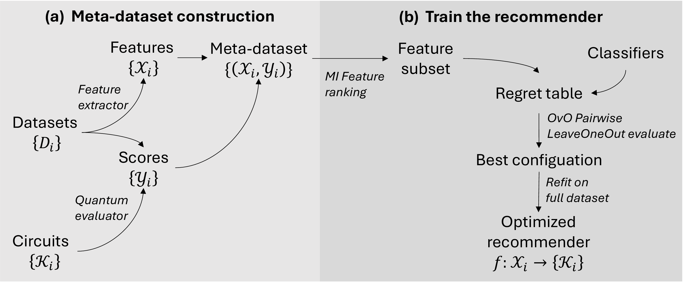

<p align="center">
  
</p>

<p align="center">
  <a href="https://github.com/tungduy1704/Qmes/actions/workflows/ci.yml"></a>
</p>

**Q**uantum **M**eta-learning for **E**ncoding **S**election in **Q**uantum **K**ernel **M**ethods --- Qmes characterizes a dataset using classical complexity measures and queries a pre-trained model to recommend a suitable encoding circuit, with no quantum evaluation at inference time.

📖 **Documentation:** [tungduy1704.github.io/Qmes](https://tungduy1704.github.io/Qmes)

Given a new dataset `(X, y)` and a task type, Qmes formulates encoding-circuit selection as a supervised meta-learning problem: the input is the data complexity extracted from the dataset, and the output is the encoding circuit - from a fixed pool - predicted to perform best. The meta-learner is trained offline on a meta-dataset built from prior quantum-kernel evaluations; at inference time it performs a single classical prediction, avoiding the per-circuit quantum evaluation an exhaustive search would require. 

---

## Idea

Selecting a circuit conventionally means evaluating every candidate on the target dataset - and neither the resulting kernel matrix nor the ranking carries over to a new dataset, so the search must be repeated in full each time. Qmes pays this quantum cost once, offline: it evaluates every circuit on many benchmark datasets and describes each with classical complexity measures, then trains a classical meta-learner to map complexity measures to a recommended circuit. At inference time, only this classical model runs - no additional quantum evaluation.

---

## Architecture

Three pluggable components, each an abstract base class with one concrete implementation per task type:

| Component | Base class | Role |
|---|---|---|
| **Extractor** | `BaseExtractor` | Compute a fixed-length meta-feature vector from a dataset |
| **Evaluator** | `BaseEvaluator` | Score every circuit on a dataset to produce meta-labels (offline only) |
| **Recommender** | `PairwiseRecommender` | Classical meta-learner: predict a circuit ranking from meta-features |



---

## Installation

```bash
git clone https://github.com/tungduy1704/Qmes.git
cd Qmes
pip install -e .
```

Requires **Python ≥ 3.10**. Runtime dependencies (`numpy`, `pandas`,
`scikit-learn`, `problexity`) are declared in `pyproject.toml` and installed
automatically; Qsun is bundled inside the package - no separate install
needed. Rebuilding the meta-dataset from UCI sources additionally needs
`pip install -e ".[data]"`.

---

## Quick start (inference)

```python
from sklearn.datasets import load_breast_cancer
from Qmes import get_extractor, load_default_recommender, recommend

X, y = load_breast_cancer(return_X_y=True)

extractor = get_extractor("classification")
recommender = load_default_recommender("classification")
result = recommend(X, y, extractor=extractor, recommender=recommender)

print("Top circuits:", result["top_k"])
# Top circuits: ['unit', 'RY', 'HERx']
print("Full ranking:", result["ranking"])
# Full ranking: ['unit', 'RY', 'HERx', 'SRx', 'RY_CX', 'HD', 'ZFM']
print("Vote counts:", result['votes'])
# Vote counts: {'unit': 6, 'SRx': 3, 'RY': 5, 'HERx': 4, 'RY_CX': 2, 'ZFM': 0, 'HD': 1}
```

Regression is the identical call pattern with `"regression"` in both
`get_extractor` and `load_default_recommender`. See the
[Quick Start guide](https://tungduy1704.github.io/Qmes/quickstart/) for more.

---

## Offline pipeline (build meta-dataset + train)

Numbered scripts under `scripts/clf/` and `scripts/reg/` run the full offline workflow. Run them in order:

| Step | Script | Output |
|---|---|---|
| 1 | `1_extract.py` | Meta-features for all benchmark datasets |
| 2 | `2_evaluate.py` | Quantum-kernel circuit scores (the Oracle / meta-labels) |
| 3 | `3_train.py` | LOO model selection over classifiers × feature subsets |
| 4 | `4_select_save.py` | Fit and serialize the chosen recommender bundle(s) |
| 5 | `5_inference.py` | End-to-end evaluation on held-out datasets |
| 6 | `6_baseline.py` | Baseline comparisons |

---

## License

Qmes is released under the **MIT License** (see [`LICENSE`](LICENSE)).

It bundles the **Qsun** quantum simulator in `Qmes/Qsun/`, which is a separate
work under its own MIT License (© 2022 Quoc Chuong Nguyen, see
[`Qmes/Qsun/LICENSE`](Qmes/Qsun/LICENSE) and [`NOTICE`](NOTICE)). If you use
Qmes, please cite both Qmes and Qsun.

---

## Authors

- **Dao Duy Tung** ¹,² — *lead developer*
- **Quoc Chuong Nguyen** ³ — *corresponding author*
- **Vu Tuan Hai** ⁴,²
- **Le Bin Ho** ⁵,⁶
- **Lan Nguyen Tran** ¹,²

¹ University of Science, Vietnam National University, Ho Chi Minh City, Vietnam<br>
² Vietnam National University, Ho Chi Minh City, Vietnam<br>
³ Institute of Fundamental and Applied Sciences, Duy Tan University, Ho Chi Minh City, Vietnam<br>
⁴ University of Information Technology, Vietnam National University, Ho Chi Minh City, Vietnam<br>
⁵ Graduate School of Engineering, Tohoku University, Sendai, Japan<br>
⁶ Frontier Research Institute for Interdisciplinary Sciences, Tohoku University, Sendai, Japan

The bundled **Qsun** simulator is the work of Nguyen Q. C., Ho L. B., Nguyen Tran L., and Nguyen H. Q. - please cite it separately (below).

## Citation

If you use Qmes in your research, please cite the accompanying paper:

```bibtex
@misc{tung2026automatedselectionquantumencoding,
  title         = {Towards Automated Selection of Quantum Encoding Circuits via Meta-Learning},
  author        = {Dao Duy Tung and Nguyen Quoc Chuong and Vu Tuan Hai and Le Bin Ho and Lan Nguyen Tran},
  year          = {2026},
  eprint        = {2604.19076},
  archivePrefix = {arXiv},
  primaryClass  = {quant-ph},
  url           = {https://arxiv.org/abs/2604.19076}
}

@article{Nguyen_2022,
  doi       = {10.1088/2632-2153/ac5997},
  url       = {https://doi.org/10.1088/2632-2153/ac5997},
  year      = {2022},
  month     = {mar},
  publisher = {IOP Publishing},
  volume    = {3},
  number    = {1},
  pages     = {015034},
  author    = {Nguyen, Quoc Chuong and Ho, Le Bin and Nguyen Tran, Lan and Nguyen, Hung Q},
  title     = {Qsun: an open-source platform towards practical quantum machine learning applications},
  journal   = {Machine Learning: Science and Technology},
  abstract  = {Currently, quantum hardware is restrained by noises and qubit numbers. Thus, a quantum virtual machine (QVM) that simulates operations of a quantum computer on classical computers is a vital tool for developing and testing quantum algorithms before deploying them on real quantum computers. Various variational quantum algorithms (VQAs) have been proposed and tested on QVMs to surpass the limitations of quantum hardware. Our goal is to exploit further the VQAs towards practical applications of quantum machine learning (QML) using state-of-the-art quantum computers. In this paper, we first introduce a QVM named Qsun, whose operation is underlined by quantum state wavefunctions. The platform provides native tools supporting VQAs. Especially using the parameter-shift rule, we implement quantum differentiable programming essential for gradient-based optimization. We then report two tests representative of QML: quantum linear regression and quantum neural network.}
}
```

> **Note:** the Qmes citation above is provisional. It will be updated with the final reference once the work is formally submitted/published.
